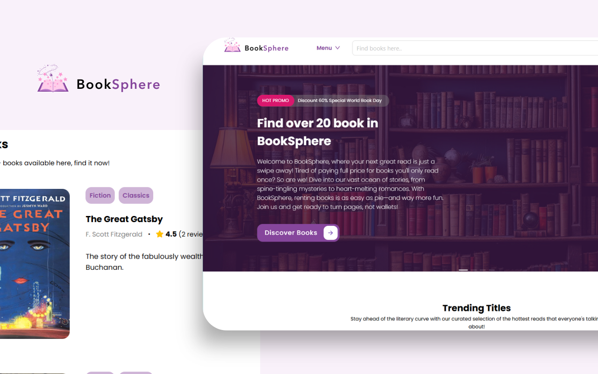

# BookSphere

BookSphere is a MERN (MongoDB, Express.js, React.js, Node.js) stack application that serves as a bookshop where users can borrow books. It features authentication using JSON Web Tokens (JWT) and an admin interface for managing books.



## Features

- User authentication with JWT
- Admin interface for managing books
- Ability to browse and borrow books
- Docker Compose setup for easy deployment

## Technologies Used

- MongoDB
- Express.js
- React.js
- Node.js
- Docker

## Installation

1. Clone the repository:

    ```bash
    https://github.com/Zouini-Hajar/library_mern.git
    ```

2. Navigate to the project directory:

    ```bash
    cd library_mern
    ```

3. Install dependencies for both backend and frontend:

    ```bash
    cd backend && npm install && cd ../frontend && npm install && cd ..
    ```

4. Start the application using Docker Compose:

    ```bash
    docker-compose up --build
    ```

5. Access the application at [http://localhost:3000](http://localhost:3000)

## Usage

- Register for an account to access the bookshop.
- Browse available books and borrow the ones you're interested in.
- Admins can access the admin interface to add, update, or delete books.

## Contributing

Contributions are welcome! If you find any bugs or have suggestions for improvement, feel free to open an issue or submit a pull request.

## License

This project is licensed under the [MIT License](LICENSE).
